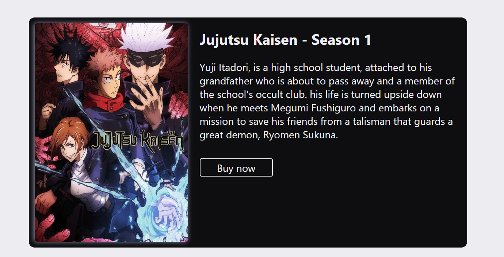

# Poster React

## Descrição
Uma galeria de pôsters de um dos meus animes favoritos. 

Este projeto é uma extensao do meu aprendizado em React.
Após algumas horas de estudo teórico e alguns exercícios eu me senti confortável em executar este pequeno projeto prático.

Aqui eu me desafiei a criar um componente útil e funcional.
E a combinar meu recém adquirido conhecimento de React com o que eu já sabia de CSS e responsividade.

## Fotos do projeto
Abaixo algumas imagens do projeto, onde é possível ver como os componentes de poster de comportam em diferentes tamanhos de tela:

